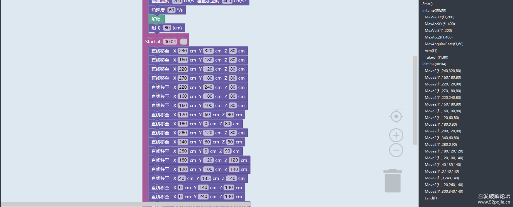

## 小鸟飞飞图形化编程炫舞软件 辅助计算分析和自动编写飞行延时
###  **在吾爱上的发布和一些解释和介绍   https://www.52pojie.cn/thread-1915977-1-1.html**   可以先看一眼（没有写md的想法，除非吾爱死掉了）

.exe的打包版本在发布页（防止你没有python3，毕竟好像基本大部分提供的电脑都是py2环境？）

**默认携带百位精确（因为听说F400只能精确到0.1秒）**

##### 逻辑
辅助计算逻辑是通过逆向直接获得辅助计算代码
在具体逻辑上，代码中读取了前两个move_to_coord_blocks块（//default_ns:block[@type="Goertek_MoveToCoord"]），再将两个坐标点填入辅助计算中，并手动输入acc和hspeed，从而得出辅助计算的time，接着进行进一的模糊处理（最后两位），从而将这个值作为delay_time(延时)的time值，接着将这个延时"插入“xml中（为什么是"插入”，主要还是xml的格式很奇怪，它是将下一个块通过<next>包裹之后作为上一个块的子元素）

##### 读写方式
脚本一定可以读的编写方式：（像这样从头直线移到尾）

脚本一定不能读的编写方式：
1、标定点
2、其他所有

此外请注意：
 - 如果在自动化脚本前就把灯写上了，那么灯会到延时之后
 - 生成中不会生成第一个延时（也就是从无人机初始位置到第一个坐标点，第一个坐标点之后的第一个延时）
 - 执行前请先备份（直接文件夹选上打包结束）
 - 别忘了模拟 <(￣︶￣)>

如果出现报错可以尝试一下删一下名字中的中文字符？（虽然自己而言没有碰上过）

**代码所有代码皆为gpt生成，没有例外（对话的都是泪）**
